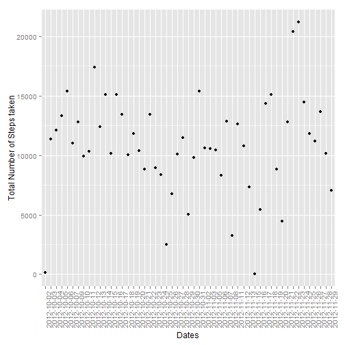
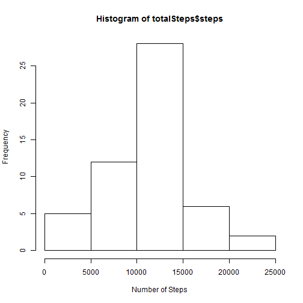
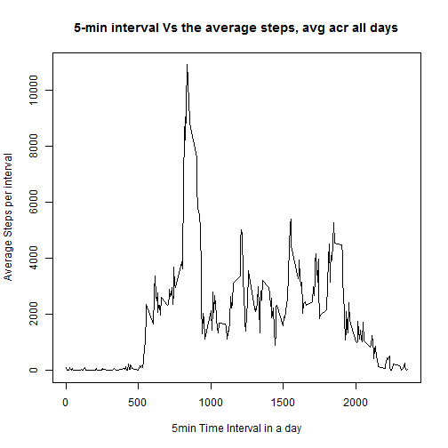
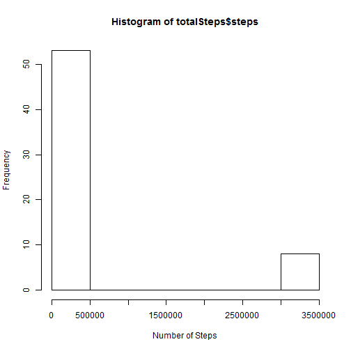
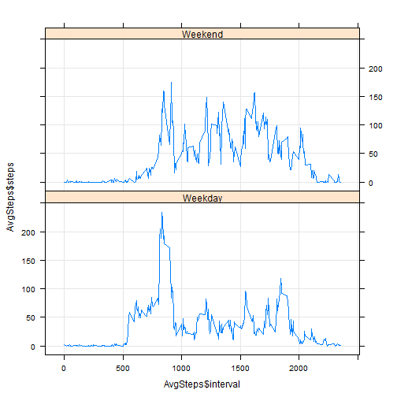

### Assignment1 and Requirements
This is an R Markdown document for assignment 1 under Reproducible Research.

This document needs to be processed by Knitr to transform in the HTML File.

Need to use
- echo = TRUE
- base lattice ggplot2
- Fork
- Push the assignment into the forked repository
- URL of forked and SHA-1 commmit ID
- Use the Forked Git hub Repo

### Loading and preprocessing the data


```r
require(knitr)
opts_knit$set("c:\\coursera\\reproducibleResearch\\assignment1\\RepData_PeerAssessment1")
unzip('activity.zip',overwrite=TRUE)
Actdata = read.csv("activity.csv",na.strings = "NA",header=TRUE)
Actdata = na.omit(Actdata)
head(Actdata)
```

```
##     steps       date interval
## 289     0 2012-10-02        0
## 290     0 2012-10-02        5
## 291     0 2012-10-02       10
## 292     0 2012-10-02       15
## 293     0 2012-10-02       20
## 294     0 2012-10-02       25
```
### What is mean total number of steps taken per day?


```r
# 1. totalSteps variables: Calculate the total number of steps taken per day
require(plyr)
totalSteps = ddply(Actdata,"date",numcolwise(sum))
require(ggplot2)
q <- qplot(totalSteps$date,totalSteps$steps,xlab = 'Dates', ylab = 'Total Number of Steps taken')

#title('Total number of steps taken per day')
q+theme(axis.text.x = element_text(angle = 90, hjust = 1))
```

 

```r
# 2. Make a histogram of the total number of steps taken each day
require(util)
hist(totalSteps$steps,xlab = 'Number of Steps', ylab = 'Frequency')
```

 

```r
# 3. Calculate and report the mean and median of the total number of steps taken per day
summary(totalSteps$steps)
```

```
##    Min. 1st Qu.  Median    Mean 3rd Qu.    Max. 
##      41    8841   10760   10770   13290   21190
```

```r
meanSteps <- mean(totalSteps$steps)
medianSteps <- median(totalSteps$steps)
```

### What is the average daily activity pattern?

```r
# 1. Make a time series plot (i.e. type = "l") of the 5-minute interval (x-axis) and the average number of steps taken, averaged across all days (y-axis)
dailyPattern = ddply(Actdata,"interval",numcolwise(sum))
plot(dailyPattern$interval,dailyPattern$steps,type='l',xlab='5min Time Interval in a day',ylab='Average Steps per interval')
title('5-min interval Vs the average steps, avg acr all days')
```

 

```r
# 2. Which 5-minute interval, on average across all the days in the dataset, contains the maximum number of steps?

# Maximum Number of steps
max(dailyPattern$steps)
```

```
## [1] 10927
```

```r
# Corresponding 5-minute interval on average across all the days
dailyPattern$interval[which(grepl(max(dailyPattern$steps), dailyPattern$steps))]
```

```
## [1] 835
```

### Imputing missing values


```r
# 1. Calculate and report the total number of missing values in the dataset (i.e. the total number of rows with NAs)

missingValue = read.csv("activity.csv",na.strings = "NA",header=TRUE)

miss <- is.na(missingValue$steps)

# 2. Devise a strategy for filling in all of the missing values in the dataset. The strategy does not need to be sophisticated. For example, you could use the mean/median for that day, or the mean for that 5-minute interval, etc.

# Find missingIndices
missingIndices <- which(miss==TRUE)

# Before imputing missing Values
head(missingValue)
```

```
##   steps       date interval
## 1    NA 2012-10-01        0
## 2    NA 2012-10-01        5
## 3    NA 2012-10-01       10
## 4    NA 2012-10-01       15
## 5    NA 2012-10-01       20
## 6    NA 2012-10-01       25
```

```r
# Replace steps with the mean
replaceValueMatrix <- missingValue
replaceValueMatrix$steps[missingIndices] <- matrix(meanSteps,length(missingIndices),1,byrow=TRUE)

# 3. Create a new dataset that is equal to the original dataset but with the missing data filled in.

# After imputing missing Values
head(replaceValueMatrix)
```

```
##      steps       date interval
## 1 10766.19 2012-10-01        0
## 2 10766.19 2012-10-01        5
## 3 10766.19 2012-10-01       10
## 4 10766.19 2012-10-01       15
## 5 10766.19 2012-10-01       20
## 6 10766.19 2012-10-01       25
```

```r
# 4. Make a histogram of the total number of steps taken each day and Calculate and report the mean and median total number of steps taken per day. Do these values differ from the estimates from the first part of the assignment? What is the impact of imputing missing data on the estimates of the total daily number of steps?

# Histogram
totalSteps = ddply(replaceValueMatrix,"date",numcolwise(sum))

hist(totalSteps$steps,xlab = 'Number of Steps', ylab = 'Frequency')
```

 

```r
#title('Histogram of the total number of steps taken each day')

# Mean and Median
summary(replaceValueMatrix$steps)
```

```
##    Min. 1st Qu.  Median    Mean 3rd Qu.    Max. 
##       0       0       0    1444      57   10770
```

```r
# Comparing mean for the replaced dataSet we observe mean has reduced 1444 (this means number of NA which were replaced dominate the overall mean) and median is 0 (After considering the NA replaced elements the median is the element under 0)

meanSteps <- mean(replaceValueMatrix$steps)
medianSteps <- median(replaceValueMatrix$steps)
```

# Are there differences in activity patterns between weekdays and weekends?


```r
# 1. Create a new factor variable in the dataset with two levels - "weekday" and "weekend" indicating whether a given date is a weekday or weekend day.

Actdata["FactorVariable"] <- NA
Actdata$FactorVariable <- weekdays(as.Date(Actdata$date))
Actdata$FactorVariable[Actdata$FactorVariable == 'Monday'] = 'Weekday'
Actdata$FactorVariable[Actdata$FactorVariable == 'Tuesday'] = 'Weekday'
Actdata$FactorVariable[Actdata$FactorVariable == 'Wednesday'] = 'Weekday'
Actdata$FactorVariable[Actdata$FactorVariable == 'Thursday'] = 'Weekday'
Actdata$FactorVariable[Actdata$FactorVariable == 'Friday'] = 'Weekday'
Actdata$FactorVariable[Actdata$FactorVariable == 'Saturday'] = 'Weekend'
Actdata$FactorVariable[Actdata$FactorVariable == 'Sunday'] = 'Weekend'

# 2. Make a panel plot containing a time series plot (i.e. type = "l") of the 5-minute interval (x-axis) and the average number of steps taken, averaged across all weekday days or weekend days (y-axis). See the README file in the GitHub repository to see an example of what this plot should look like using simulated data.
library(lattice)

AvgSteps = ddply(Actdata,cbind("FactorVariable","interval"),numcolwise(mean))

xyplot(AvgSteps$steps ~ AvgSteps$interval| AvgSteps$FactorVariable, 
       grid = TRUE, type = 'l', layout=c(1,2))
```

 
